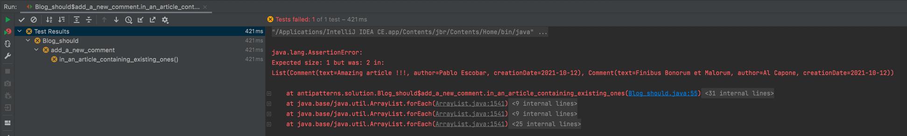

## PriceEngineTests

```java
class PriceEngineTests {
    @Test
    void discount_of_2_products_should_be_3_percent() {
        val products = List.of(new Product("P1"), new Product("P2"), new Product("P3"));
        val discount = PriceEngine.calculateDiscount(products.toArray(new Product[0]));

        assertThat(discount).isEqualTo(products.size() * 0.01);
    }
}
```

* Test is always a sample
    * Refactor this test

```java
class PriceEngineRefactoredTests {
    @Test
    void discount_of_2_products_should_be_3_percent() {
        val products = List.of(new Product("P1"), new Product("P2"), new Product("P3"));
        val discount = PriceEngine.calculateDiscount(products.toArray(new Product[0]));

        // Fine to use "hardcoded" values in test
        // It is from our test case
        assertThat(discount).isEqualTo(0.03);
    }
}
```

## TodoTests

```java
class TodoTests {
    @Test
    void it_should_call_search_on_repository_with_the_given_text() {
        val todoRepositoryMock = mock(TodoRepository.class);
        val todoService = new TodoService(todoRepositoryMock);

        val searchResults = List.of(
                new Todo("Create miro", "add code samples in the board"),
                new Todo("Add myths in miro", "add mythbusters from ppt in the board")
        );
        val searchedText = "miro";

        when(todoRepositoryMock.search(searchedText))
                .thenReturn(searchResults);

        // The Subject Under Test is a mock
        val result = todoRepositoryMock.search(searchedText);

        // Here we assert that the call on our mock returns what we set up
        // We test Mockito here...
        assertThat(result).isEqualTo(searchResults);
        verify(todoRepositoryMock, times(1)).search(searchedText);
    }
}
```

* Use the true SUT : `Never use a Mock as a Subject Under Test`

```java
class TodoRefactoredTests {
    @Test
    void it_should_call_search_on_repository_with_the_given_text() {
        val todoRepositoryMock = mock(TodoRepository.class);
        val todoService = new TodoService(todoRepositoryMock);

        val searchResults = List.of(
                new Todo("Create miro", "add code samples in the board"),
                new Todo("Add myths in miro", "add mythbusters from ppt in the board")
        );
        val searchedText = "miro";

        when(todoRepositoryMock.search(searchedText))
                .thenReturn(searchResults);

        // The SUT is the TodoService that (in this simple version) will only delegates call to Repository
        // Would have more responsibility in real life (authorization, quotas, filtering, ...)
        val result = todoService.search(searchedText);

        assertThat(result).isEqualTo(searchResults);
        verify(todoRepositoryMock, times(1)).search(searchedText);
    }
}
```

## BlogTests

```java
package antipatterns;

import blog.Article;
import lombok.val;
import org.junit.jupiter.api.Test;

import static org.assertj.core.api.Assertions.assertThat;

class BlogTests {
    @Test
        // Have a business oriented name for the test : what is a Right on a business perspective ?
        // What is a valid comment ?
    void it_should_return_a_Right_for_valid_comment() {
        // Repeated in each test
        val article = new Article(
                "Lorem Ipsum",
                "consectetur adipiscing elit, sed do eiusmod tempor incididunt ut labore"
        );

        val result = article.addComment("Amazing article !!!", "Pablo Escobar");

        assertThat(result.isRight()).isTrue();
    }

    @Test
    void it_should_add_a_comment_with_the_given_text() {
        val article = new Article(
                "Lorem Ipsum",
                "consectetur adipiscing elit, sed do eiusmod tempor incididunt ut labore"
        );

        val text = "Amazing article !!!";
        val result = article.addComment(text, "Pablo Escobar");

        assertThat(result.get().getComments())
                .hasSize(1)
                .anyMatch(comment -> comment.getText().equals(text));
    }

    // 1 test to test each comment value...
    // 4 tests instead of 1 to maintain
    @Test
    void it_should_add_a_comment_with_the_given_author() {
        val article = new Article(
                "Lorem Ipsum",
                "consectetur adipiscing elit, sed do eiusmod tempor incididunt ut labore"
        );

        val author = "Pablo Escobar";
        val result = article.addComment("Amazing article !!!", author);

        assertThat(result.get().getComments())
                .hasSize(1)
                .anyMatch(comment -> comment.getAuthor().equals(author));
    }

    @Test
    void it_should_add_a_comment_with_the_date_of_the_day() {
        val article = new Article(
                "Lorem Ipsum",
                "consectetur adipiscing elit, sed do eiusmod tempor incididunt ut labore"
        );

        val result = article.addComment("Amazing article !!!", "Pablo Escobar");
        // Missing assertions
    }

    @Test
    void it_should_return_a_Left_when_adding_existing_comment() {
        val article = new Article(
                "Lorem Ipsum",
                "consectetur adipiscing elit, sed do eiusmod tempor incididunt ut labore"
        );

        val result =
                article.addComment("Amazing article !!!", "Pablo Escobar")
                        .map(a -> a.addComment("Amazing article !!!", "Pablo Escobar"))
                        .flatMap(r -> r);

        // What is inside the Left ?
        assertThat(result.isLeft()).isTrue();
    }
}
```

* Remove duplication
    * If you need to instantiate a lot of object, centralize it in TestDataBuilders (Use Lombok Builder)
        * If you change your models, it will be easier to maintain

```java
class BlogRefactoredTests {
    private Article article;

    @BeforeEach
    void init() {
        article = new Article(
                "Lorem Ipsum",
                "consectetur adipiscing elit, sed do eiusmod tempor incididunt ut labore"
        );
    }

    @Test
    void it_should_return_a_Right_for_valid_comment() {
        val result = article.addComment("Amazing article !!!", "Pablo Escobar");

        assertThat(result.isRight()).isTrue();
    }

    @Test
    void it_should_add_a_comment_with_the_given_text() {
        val text = "Amazing article !!!";
        val result = article.addComment(text, "Pablo Escobar");

        assertThat(result.get().getComments())
                .hasSize(1)
                .anyMatch(comment -> comment.getText().equals(text));
    }

    @Test
    void it_should_add_a_comment_with_the_given_author() {
        val author = "Pablo Escobar";
        val result = article.addComment("Amazing article !!!", author);

        assertThat(result.get().getComments())
                .hasSize(1)
                .anyMatch(comment -> comment.getAuthor().equals(author));
    }

    @Test
    void it_should_add_a_comment_with_the_date_of_the_day() {
        val result = article.addComment("Amazing article !!!", "Pablo Escobar");
    }

    @Test
    void it_should_return_a_Left_when_adding_existing_comment() {
        val result =
                article.addComment("Amazing article !!!", "Pablo Escobar")
                        .map(a -> a.addComment("Amazing article !!!", "Pablo Escobar"))
                        .flatMap(r -> r);

        assertThat(result.isLeft()).isTrue();
    }
}
```

* Each test should represent a behavior
    * Not data oriented

```java
    @Test
    void it_should_return_a_Right_Article_containing_a_new_comment_including_given_text_and_author() {
        val text = "Amazing article !!!";
        val author = "Pablo Escobar";

        val result = article.addComment(text, author);

        assertThat(result.isRight()).isTrue();
        assertThat(result.get().getComments())
                .hasSize(1)
                .anyMatch(comment -> comment.getText().equals(text) &&
                        comment.getAuthor().equals(author) &&
                        comment.getCreationDate().isEqual(LocalDate.now()));
    }
```

* Be careful with date
    * Non deterministic data
    * Ideally inject a Clock function
    * We can use `isBeforeOrEqualTo` from AssertJ
```java
    @Test
    void it_should_return_a_Right_Article_containing_a_new_comment_including_given_text_and_author() {
        val text = "Amazing article !!!";
        val author = "Pablo Escobar";

        val result = article.addComment(text, author);

        assertThat(result.isRight()).isTrue();
        assertComment(result.get().getComments().head(), text, author);
    }

    private void assertComment(Comment comment,
                               String expectedText,
                               String expectedAuthor) {
        assertThat(comment.getText()).isEqualTo(expectedText);
        assertThat(comment.getAuthor()).isEqualTo(expectedAuthor);
        assertThat(comment.getCreationDate()).isBeforeOrEqualTo(LocalDate.now());
    }
```
* Remove the 3 other tests

```java
class BlogRefactoredTests {
    private Article article;

    @BeforeEach
    void init() {
        article = new Article(
                "Lorem Ipsum",
                "consectetur adipiscing elit, sed do eiusmod tempor incididunt ut labore"
        );
    }

    @Test
    void it_should_return_a_Right_Article_containing_a_new_comment_including_given_text_and_author() {
        val text = "Amazing article !!!";
        val author = "Pablo Escobar";

        val result = article.addComment(text, author);

        assertThat(result.isRight()).isTrue();
        assertComment(result.get().getComments().head(), text, author);
    }

    private void assertComment(Comment comment,
                               String expectedText,
                               String expectedAuthor) {
        assertThat(comment.getText()).isEqualTo(expectedText);
        assertThat(comment.getAuthor()).isEqualTo(expectedAuthor);
        assertThat(comment.getCreationDate()).isBeforeOrEqualTo(LocalDate.now());
    }

    @Test
    void it_should_return_a_Left_when_adding_existing_comment() {
        val result =
                article.addComment("Amazing article !!!", "Pablo Escobar")
                        .map(a -> a.addComment("Amazing article !!!", "Pablo Escobar"))
                        .flatMap(r -> r);

        assertThat(result.isLeft()).isTrue();
    }
}
```

* Rename the test to remove implementation details

```java
    @Test
    void it_should_add_a_new_comment_in_the_article_including_given_text_and_author() {
        val text = "Amazing article !!!";
        val author = "Pablo Escobar";

        val result = article.addComment(text, author);

        assertThat(result.isRight()).isTrue();
        assertComment(result.get().getComments().head(), text, author);
    }
```

* Improve the error test case
    * Rename the test
    * Assert the validation error

```java
    @Test
    void it_should_return_an_error_when_adding_an_existing_comment() {
        val result =
                article.addComment(text, author)
                        .map(a -> a.addComment(text, author))
                        .flatMap(r -> r);

        assertThat(result.isLeft()).isTrue();
        assertThat(result.getLeft())
                .hasSize(1)
                .allMatch(error -> error.getDescription().equals("Comment already in the article"));
    }
```

* Add missing test case
    * What happens if we add a comment on an Article containing existing ones ?

```java
    @Test
    void it_should_add_a_new_comment_in_an_article_containing_existing_ones() {
        val newText = "Finibus Bonorum et Malorum";
        val newAuthor = "Al Capone";

        val result = article.addComment(text, author)
                .map(a -> a.addComment(newText, newAuthor))
                .flatMap(r -> r);

        assertThat(result.isRight()).isTrue();
        assertThat(result.get().getComments()).hasSize(2);
        assertComment(result.get().getComments().last(), newText, newAuthor);
    }
```

* Could we improve our tests again ?

```java
class BlogRefactoredTests {
    private final String text = "Amazing article !!!";
    private final String author = "Pablo Escobar";
    private Article article;

    private static void assertComment(Comment comment,
                                      String expectedText,
                                      String expectedAuthor) {
        assertThat(comment.getText()).isEqualTo(expectedText);
        assertThat(comment.getAuthor()).isEqualTo(expectedAuthor);
        assertThat(comment.getCreationDate()).isBeforeOrEqualTo(LocalDate.now());
    }

    @BeforeEach
    void init() {
        article = new Article(
                "Lorem Ipsum",
                "consectetur adipiscing elit, sed do eiusmod tempor incididunt ut labore"
        );
    }

    @Test
    void it_should_add_a_new_comment_in_the_article_including_given_text_and_author() {
        val result = article.addComment(text, author);

        assertThat(result.isRight()).isTrue();
        assertComment(result.get().getComments().head(), text, author);
    }

    @Test
    void it_should_add_a_new_comment_in_an_article_containing_existing_ones() {
        val newText = "Finibus Bonorum et Malorum";
        val newAuthor = "Al Capone";

        val result = article.addComment(text, author)
                .map(a -> a.addComment(newText, newAuthor))
                .flatMap(r -> r);

        assertThat(result.isRight()).isTrue();
        assertThat(result.get().getComments()).hasSize(2);
        assertComment(result.get().getComments().last(), newText, newAuthor);
    }

    @Test
    void it_should_return_an_error_when_adding_an_existing_comment() {
        val result = article.addComment(text, author)
                    .map(a -> a.addComment(text, author))
                    .flatMap(r -> r);
        
        assertThat(result.isLeft()).isTrue();
        assertThat(result.getLeft())
                .hasSize(1)
                .allMatch(error -> error.getDescription().equals("Comment already in the article"));
    }
}
```

* Rename result into a more business oriented name like `updatedArticle` for instance
* What else ?
  * Split test cases between failure and success ?
    * We can use @Nested classes to do so
```java
class Blog_should {
    private final String text = "Amazing article !!!";
    private final String author = "Pablo Escobar";
    private Article article;

    private static void assertComment(Comment comment,
                                      String expectedText,
                                      String expectedAuthor) {
        assertThat(comment.getText()).isEqualTo(expectedText);
        assertThat(comment.getAuthor()).isEqualTo(expectedAuthor);
        assertThat(comment.getCreationDate()).isBeforeOrEqualTo(LocalDate.now());
    }

    @BeforeEach
    void init() {
        article = new Article(
                "Lorem Ipsum",
                "consectetur adipiscing elit, sed do eiusmod tempor incididunt ut labore"
        );
    }

    @Nested
    class add_a_new_comment {
        @Test
        void in_the_article_including_given_text_and_author() {
            val updatedArticle = article.addComment(text, author);

            assertThat(updatedArticle.isRight()).isTrue();
            assertComment(updatedArticle.get().getComments().head(), text, author);
        }

        @Test
        void in_an_article_containing_existing_ones() {
            val newText = "Finibus Bonorum et Malorum";
            val newAuthor = "Al Capone";

            val updatedArticle = article.addComment(text, author)
                    .map(a -> a.addComment(newText, newAuthor))
                    .flatMap(r -> r);

            assertThat(updatedArticle.isRight()).isTrue();
            assertThat(updatedArticle.get().getComments()).hasSize(2);
            assertComment(updatedArticle.get().getComments().last(), newText, newAuthor);
        }
    }

    @Nested
    class return_an_error {
        @Test
        void when_adding_an_existing_comment() {
            val updatedArticle = article.addComment(text, author)
                    .map(a -> a.addComment(text, author))
                    .flatMap(r -> r);

            assertThat(updatedArticle.isLeft()).isTrue();
            assertThat(updatedArticle.getLeft())
                    .hasSize(1)
                    .allMatch(error -> error.getDescription().equals("Comment already in the article"));
        }
    }
}
```
* It can help understand more quickly the reason of failure of a test
